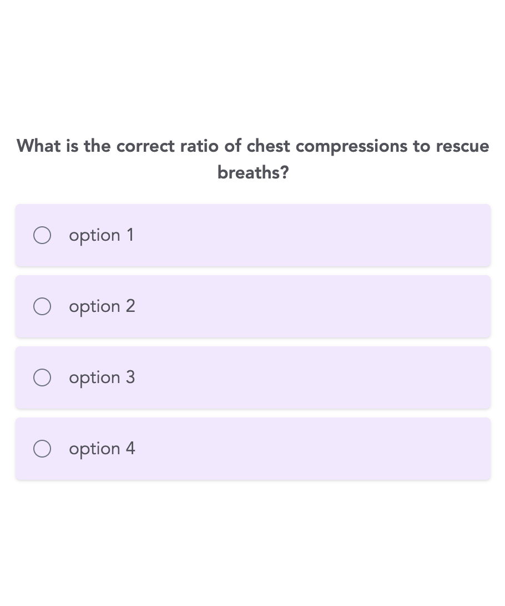
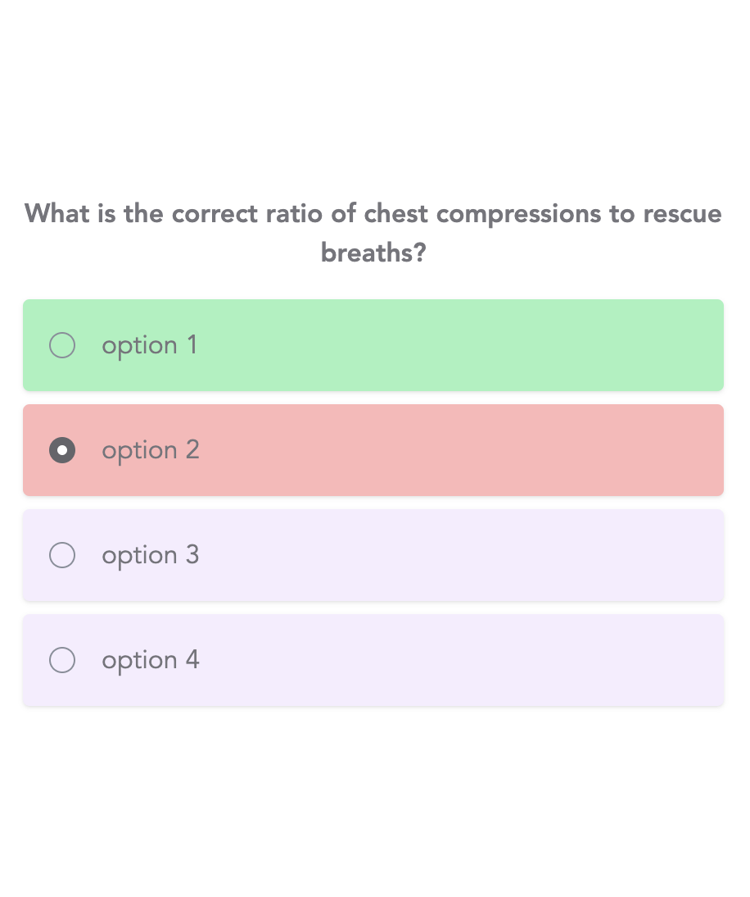
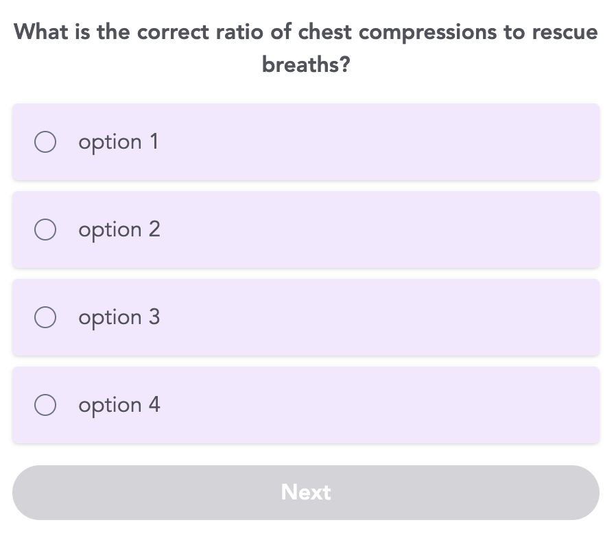
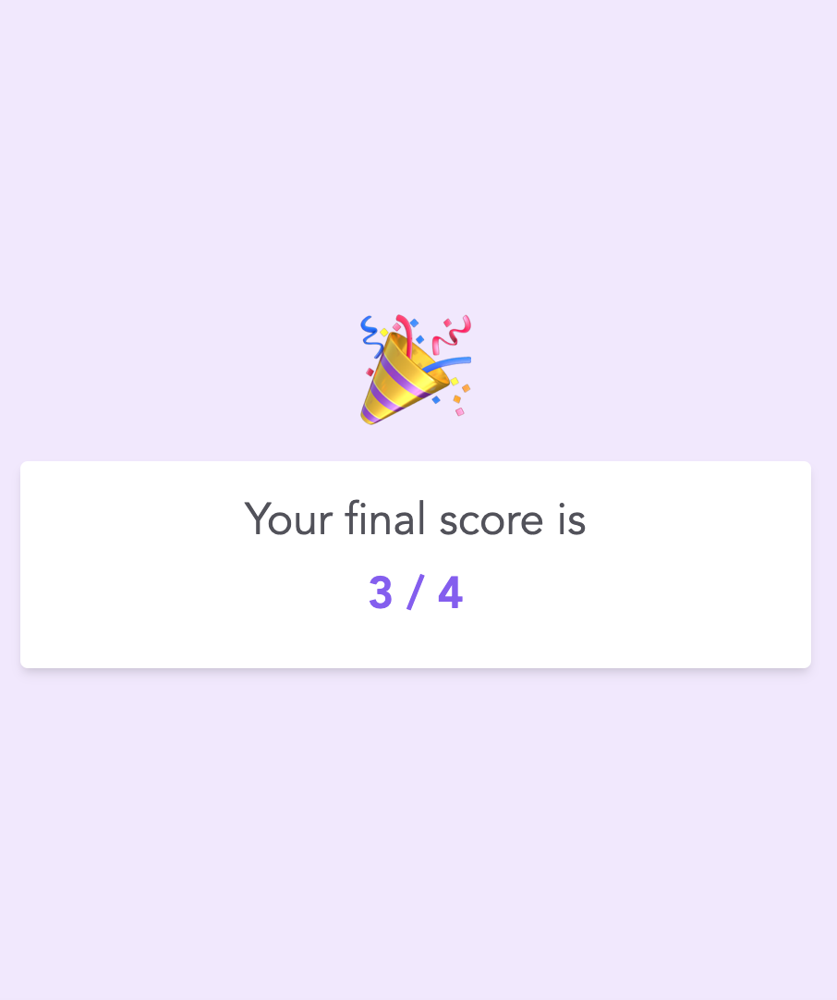
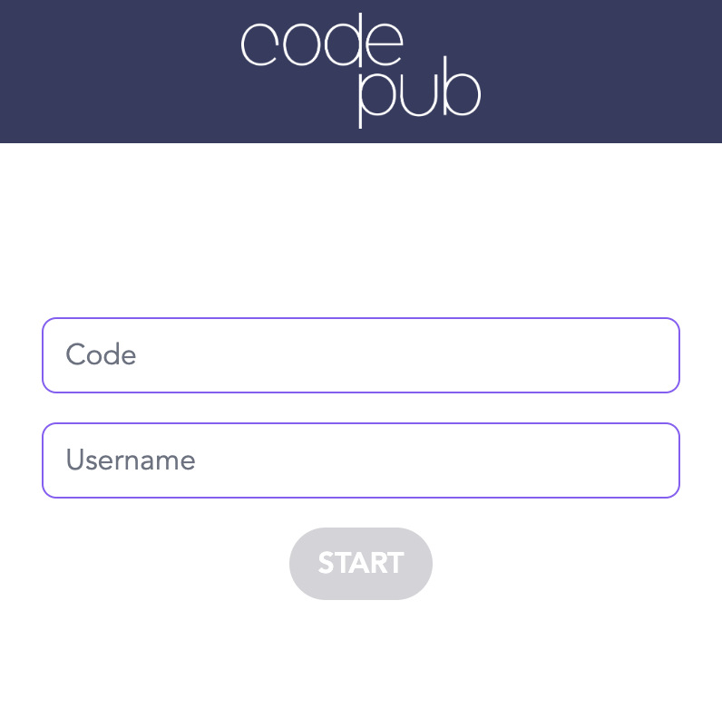

# 0. **Let's make a Quiz app with React**
Hello all Berliner Code Pubers! In this workshop, we will be creating a small quiz app with [React](https://reactjs.org/).

---

## 0.1 **How to read this README**

---

To easily follow this Workshop and README file, the README is structured according to a few conventions.

- Code and file names are written like `CodeExample`.
- Larger code parts are written as below, with the name of the vialbe file is included at the top after two `//`

```
// File Name

Newly added code together with some older code to understand where the new code should be put in
```

- If there are previous written code in the same file as the new code, this is implied by

```
/* ... */ (Previous code written)
```

- When React concepts or other important words are mentioned, they are written in bold, as **React Concept**

- If there are some deeper explainations to either concepts or why, these are written as the citation shown below. These can be skipped depending on how much in detail you want to go.
  > Example explaination of a concept

The steps are divided into **Inspection** (explanation and hints) and **Implementation** (the added code).

---

## 0.2 **Intro to the project**

---

If you are using an internal editor on your computer, you can fetch the basic project from this github repository on [the baseline branch](https://github.com/zk22/codepub-quiz/tree/baseline). The prerequisites are the following:
```
nodejs: https://nodejs.org/en/
yarn: https://classic.yarnpkg.com/lang/en/docs/install/#mac-stable
```

Otherwise, just use [React playground](https://codesandbox.io/s/quiz-app-bziuiv).

[The final branch](https://github.com/zk22/codepub-quiz/tree/final) has the final game that we play at the end of the workshop.

The template consists of multiple React TypeScript files, where each file represents a [**React component with props**](https://reactjs.org/docs/components-and-props.html).
- The `App.tsx` component routes the path  `/` to the `home.tsx` component and `quiz/:id` to the `quiz.tsx` component.
- The `home.tsx` component only has a **Start** button that upon clicking will fetch a random quiz `id` from `${BASE_URL}/random-quiz` and navigate to `quiz/:id`.
- The `quiz.tsx` component only has the text `QUIZ`.
- Other components like Question, Option, Result have fully implemented logic to handle the calculation of the correct answer and the end result.

In the following steps, we will use these components to add logic to our `quiz.tsx`. This workshop will not care about the styling - but feel free to modify if you want to.

---

# 1. **Fetch quiz questions**
The first task is to fetch quiz questions from the url `${BASE_URL}/quiz/${id}` and log in the console the content of the questions based on the `id` in the path `quiz/:id`.
Note that this url does not contain the correct option but rather the `${BASE_URL}/quiz/${id}/question/${questionId}` later on.

## Inspection

Inspecting the example url [`${BASE_URL}/quiz/quiz-1`](https://497z886l6a.execute-api.eu-central-1.amazonaws.com/prod/quiz/quiz-1) and the `question.tsx` component,  we see that the response to the url is a json containing a list of `Question` in the field `questions`, which corresponds to the `QuestionProps` interface.
```
// question.tsx
/**
interface QuestionProps {
  id: string;
  label: string;
  correctOption?: string;
  selectedOption?: string;
  onSelectOption: (questionId: string, optionId: string) => void;
}
**/
```

React has some useful [**Hooks**](https://reactjs.org/docs/hooks-intro.html) that we can get the parameter `id` from the path, store the state of the questions after fetching, and perform data fetching.

## Implementation

Import hooks [useEffect](https://reactjs.org/docs/hooks-effect.html), [useState](https://reactjs.org/docs/hooks-state.html), [useParams](https://reactrouter.com/en/main/hooks/use-params)
```
// quiz.tsx
import { useEffect, useState } from "react";
import { useParams } from "react-router";
import { BASE_URL } from "../constants";
```

Get the `id` from the path, fetch the response json from `${BASE_URL}/quiz/${id}`, set the `questions` state as `response.questions` and finally log the questions in the console. You can inspect the `console.log` with the browser Developer Tools.

```
// quiz.tsx
/**
export const Quiz = () => {
**/
  const { id } = useParams();
  const [questions, setQuestions] = useState<Question[]>([]);

  useEffect(() => {
    const getQuiz = async () => {
      const response = await fetch(`${BASE_URL}/quiz/${id}`).then((response) =>
        response.json()
      );

      setQuestions(response.questions);

      console.log(response.questions);
    };

    getQuiz();
  }, []);
/**
  return <div>QUIZ</div>;
};
**/
```

# 2. **Display first question**
Next, we want to display the question and the options using the predefined `question.tsx` and `option.tsx` components.



## Inspection
Inspecting the `Question` component, we see that a `Question` component expects an array of `Option` components as child elements.
```
// question.tsx
/**
export const Question = ({
  ...,
  children
}: React.PropsWithChildren<QuestionProps>) => {
  const manipulatedChildren = React.Children.toArray(children)
    .filter((child) => React.isValidElement(child) && child.type === Option)
    .map((child) => {
      const optionId = get(child, "props.id", "");
      return React.cloneElement(child as React.ReactElement<OptionProps>, {
      ...
      });
    });
**/
```

## Implementation
Import Question and Option components.
```
// quiz.tsx
import { Option, Question } from "../components";
```

Start with the first question at the `selectedQuestionIndex` default to `0`.
```
// quiz.tsx
/**
export const Quiz = () => {
  const { id } = useParams();
  const [questions, setQuestions] = useState<Question[]>([]); 
**/
  const [selectedQuestionIndex, setSelectedQuestionIndex] = useState(0);
/**...**/
```

Set the `selectedQuestion` to the first question by default. Render the `Quiz` component as having a `Question` component with props value of the `selectedQuestion` and children `Option` components.
```
// quiz.tsx
/**
export const Quiz = () => {
...
**/
  const selectedQuestion = questions[selectedQuestionIndex];
  if (!selectedQuestion) {
    return;
  }

  return (
    <div className="p-4 w-full md:w-96 m-auto">
      <Question
        key={selectedQuestion.id}
        id={selectedQuestion.id}
        label={selectedQuestion.label}
        onSelectOption={() => {}}
      >
        {selectedQuestion.options.map((option) => {
          return (
            <Option key={option.id} id={option.id}>
              {option.label}
            </Option>
          );
        })}
      </Question>
    </div>
  );
/**
};
**/
```

# 3. **Select an option**
Now that we have displayed the question and the options, we want to store the selected option id once chosen so that we can later compare with the correct option id.

## Inspection
Inspecting the `Question`'s `Option` component, we see that when an option is selected, the `Option` component calls the `onSelectOption` function passed over from the `Question` component with the question and option id. We should implement this function in the `Quiz` component and pass it to the `Question` component to store the option id in the `Quiz` component.
```
// question.tsx
/**
export const Question = ({
  id,
  label,
  correctOption,
  selectedOption,
  onSelectOption,
  children
}: React.PropsWithChildren<QuestionProps>) => {
... **/
      return React.cloneElement(child as React.ReactElement<OptionProps>, {
        name: id,
        value: optionId,
        checked: selectedOption === optionId,
        onChange: () => onSelectOption(id, optionId),
        /** ... **/
      });
    });
/** ... **/
```

## Implementation
Maintain the state of the `selectedOptionId`.
```
// quiz.tsx
/**
export const Quiz = () => {
  const { id } = useParams();
  const [questions, setQuestions] = useState<Question[]>([]);
  const [selectedQuestionIndex, setSelectedQuestionIndex] = useState(0);
**/
  const [selectedOptionId, setSelectedOptionId] = useState("");
/**...**/
```

When an option is selected, this function is triggered with the `questionId` and the `optionId`. Set the `selectedOptionId` with the `optionId`. The `questionId` is necessary later to fetch the correct answer from the `${BASE_URL}`.
```
	const onSelectOption = (questionId: string, optionId: string) => {
	setSelectedOptionId(optionId);
	};

/**
  const selectedQuestion = questions[selectedQuestionIndex];
  if (!selectedQuestion) {
    return;
  }
**/
```

Set the `selectedOption` and `onSelectOption` props for the `Question` component. The `selectedOption` prop is used to determine whether it's the correct answer.
```
// quiz.tsx
/**
<Question
... **/
selectedOption={selectedOptionId}
onSelectOption={onSelectOption}
>
```

# 4. **Check answer**
Now that we know which option is selected, we want to fetch the correct answer from `${BASE_URL}/quiz/${id}/question/${questionId}` and check whether the selected option is a correct one.


## Inspection
Inspecting the `Question`'s children `Option` component, we see that each displayed option is compared with the `correctOption` and `selectedOption` passed over from the `Quiz` component. The status `correct`, `incorrect` and `default` are used to set the color style of the option in the `Option` component.
```
return React.cloneElement(child as React.ReactElement<OptionProps>, {
        name: id,
        value: optionId,
        checked: selectedOption === optionId,
        onChange: () => onSelectOption(id, optionId),
        status: correctOption
          ? optionId === correctOption
            ? "correct"
            : optionId === selectedOption
            ? "incorrect"
            : "default"
          : "default",
      });
```

## Implementation
Maintain the state of `correctOptionId`.
```
// quiz.tsx
/**
  const [selectedQuestionIndex, setSelectedQuestionIndex] = useState(0);
  const [selectedOptionId, setSelectedOptionId] = useState("");
  const [correctOptionId, setCorrectOptionId] = useState("");
**/
	const [correctOptionId, setCorrectOptionId] = useState("");
```

Fetch the correct answer as soon as an option was selected. Set the `correctOptionId` as the `response.correctOption`.
```
// quiz.tsx
/**
  const onSelectOption = async (questionId: string, optionId: string) => {
    setSelectedOptionId(optionId);
**/
    const response = await fetch(
      `${BASE_URL}/quiz/${id}/question/${questionId}`
    ).then((response) => response.json());

    setCorrectOptionId(response.correctOption);
  };
```
Pass the `correctOptionId` to the `Question` component to check if the selected option is correct.
```
// quiz.tsx
/**
<Question
...
selectedOption={selectedOptionId}
onSelectOption={onSelectOption}
**/
correctOption={correctOptionId}
>
```

# 5. **Display next question**
Of course we don't just want to have one question for our quiz app! We want to display the Next button and go to the next question as soon as an option is selected for the question and the correct answer is already calculated. The button is deactivated when no option has been selected, and reactivated once an option is selected.


## Inspection
> React will efficiently update and render just the right components when your data changes.

## Implementation
As long as there are still questions in the quiz, display a Next button below the `Question` component. Disable the button if `selectedOptionId` is not set. Trigger the `next` function once the button is clicked.
```
// quiz.tsx
/**
	<Question>
	...
    </Question>
**/
    {selectedQuestionIndex < questions.length - 1 && (
    <button onClick={next} disabled={!selectedOptionId}>
        Next
    </button>
    )}
</div>
```

If there are still questions in the quiz, the `next` function should increment the `selectedQuestionIndex` and reset `selectedOptionId` and `correctOptionId`. Every change of state will cause React to render the component again.
```
// quiz.tsx
/**
  const selectedQuestion = questions[selectedQuestionIndex];
  if (!selectedQuestion) {
    return;
  }
**/
	const next = () => {
	if (selectedQuestionIndex < questions.length - 1) {
		setSelectedQuestionIndex(selectedQuestionIndex + 1);
		setSelectedOptionId("");
		setCorrectOptionId("");
	}
	};
```

# 6. **Display result**
Now we can already play through the quiz and know whether what we choose is the correct answer, but how many did we get correctly? We want to keep track of the number of correct answers and display the result at the end of the quiz. 



## Inspection
The `Result` component displays the final score and calculates the percentage of correct answers based on the number of `correct` answers over `total`.
```
// result.tsx
/**
export const Result = ({ correct, total }: ResultProps) => {
  const emoji = useMemo(() => {
    const percentage = (100 * correct) / total;

    if (percentage < 50) {
      return "💩";
    } else if (percentage < 75) {
      return "😐";
    } else if (percentage <= 100) {
      return "🎉";
    }
  }, [correct, total]);
  
  return (
/**...**/
        <div>Your final score is</div>
        <div className="font-bold text-violet-500 m-2">{`${correct} / ${total}`}</div>
/**...**/
  );
};
**/
```

## Implementation

Import the `Result` component.
```
// quiz.tsx
import { Option, Question, Result } from "../components";
```

Maintain the state `isFinished` for when the quiz has ended and `correctCount` for the number of correct answers.
```
// quiz.tsx
const [isFinished, setIsFinished] = useState(false);
const [correctCount, setCorrectCount] = useState(0);
```

After selecting an option, increment `correctCount` if the selected option is the correct one.
```
// quiz.tsx
/**
  const onSelectOption = async (questionId: string, optionId: string) => {
    setSelectedOptionId(optionId);

    const response = await fetch(
      `${BASE_URL}/quiz/${id}/question/${questionId}`
    ).then((response) => response.json());

    setCorrectOptionId(response.correctOption);
**/
    if (optionId === response.correctOption) {
      setCorrectCount(correctCount + 1);
    }
  };
```

If there are no more questions in the quiz, display a Finish button instead of a Next button below the `Question` component. Disable the button if the current quiz question has not been answered with an option yet. Trigger the `finish` function once the button is clicked.
```
// quiz.tsx
/**
	<Question>
	...
    </Question>
**/
{selectedQuestionIndex < questions.length - 1 ? (
<button onClick={next} disabled={!selectedOptionId}>
    Next
</button>
) : (
<button onClick={finish} disabled={!selectedOptionId}>
    Finish
</button>
```

Set `isFinished` to true when the quiz is over and display the `Result` component with the `correctCount` and `questions.length`.
```
// quiz.tsx
/**
  const next = () => {
    if (selectedQuestionIndex < questions.length - 1) {
      setSelectedQuestionIndex(selectedQuestionIndex + 1);
      setSelectedOptionId("");
      setCorrectOptionId("");
    }
  };
**/
	const finish = () => {
	setIsFinished(true);
	};

	if (isFinished) {
	return <Result correct={correctCount} total={questions.length} />;
	}
```

---
# [**The final Quiz app**](shorturl.at/LTY15)
The source code for the final quiz app can be found in the final branch. The code is cleaned up and includes expansions such as enabling multiple people to join in the same quiz by entering the quiz id and a username, storing a database of multiple quizzes, storing the username, score and time for the high score board. The final quiz game can be played [here](http://shorturl.at/LTY15) with the code `codepub2022`. The high score board can be seen [here](http://codepub-quiz.s3-website.eu-central-1.amazonaws.com/admin) with the password `codepub.admin`.

The architecture of the backend and frontend is as follows:


We hope you had fun creating and playing the quiz!



---
Created by [Zehra Karakaş](https://www.linkedin.com/in/zehrakarakas/). Feel free to ask me questions!